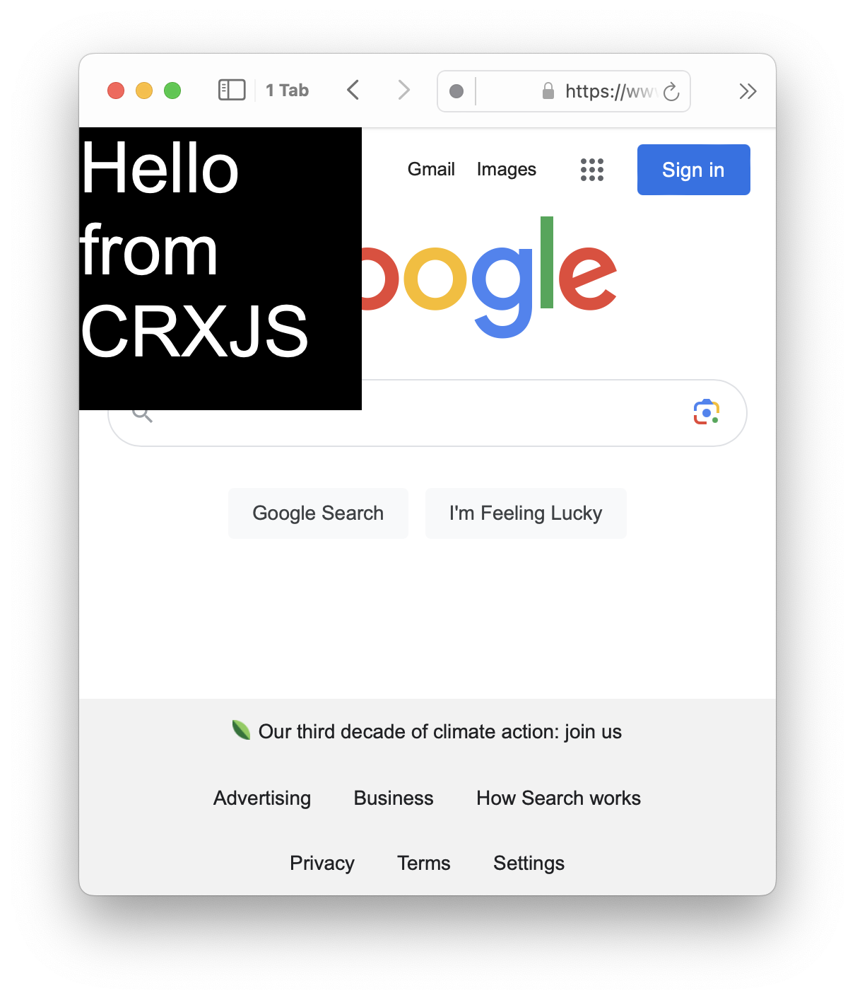

# crxjs-orion-test
A project to test CRXJS compatibility with Orion browser. While working on a chrome extension with CRXJS, I realized that it was never working in Orion's iOS browser app. This is a minimal repo to replicate the issue.

### Issue
- On Orion macOS, the extension installs fine. You will see the message "Hello from CRXJS" in a black box on google.com
- On the iOS Orion app, the extension will can be installed, but you will not see anything on google.com. Since the iOS app doesn't have an inspector, it is difficult to see any error messages that are coming up

### Testing
- Run `pnpm install` (or use npm if desired)
- Run `pnpm run build`
- Zip all the files inside the `dist` folder
- Send the zip to your phone with iOS, and install it in the Orion browser app
- Navigate to google.com to see if you can see the "Hello from CRXJS" message in a black box

Here is an image of what it is supposed to look like:

